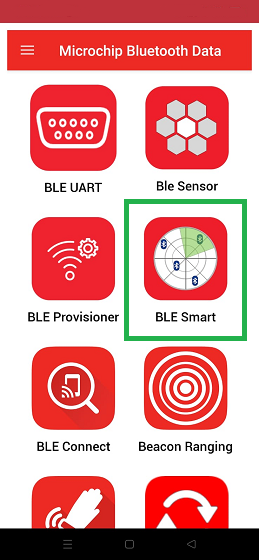
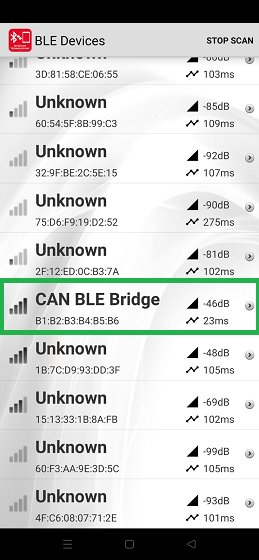
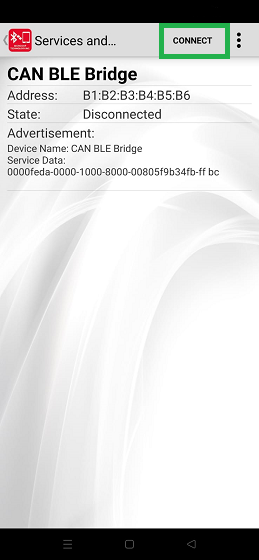
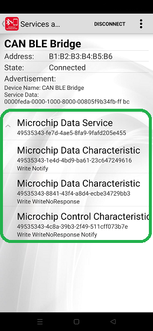
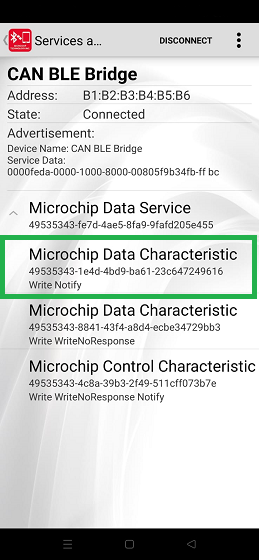
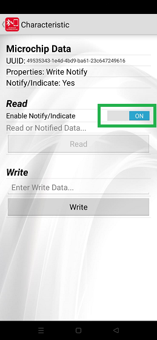

# WBZ45x BLE Peripheral Example : CAN Bus Sniffer


> "IoT Made Easy!" 

Devices: **| PIC32CXBZ2 | WBZ45x |**<br>
Features: **| CAN | BLE |**


## ⚠ Disclaimer

<p><span style="color:red"><b>
THE SOFTWARE ARE PROVIDED "AS IS" AND GIVE A PATH FOR SELF-SUPPORT AND SELF-MAINTENANCE. This repository contains example code intended to help accelerate client product development. </br>

For additional Microchip repos, see: <a href="https://github.com/Microchip-MPLAB-Harmony" target="_blank">https://github.com/Microchip-MPLAB-Harmony</a>

Checkout the <a href="https://microchipsupport.force.com/s/" target="_blank">Technical support portal</a> to access our knowledge base, community forums or submit support ticket requests.
</span></p></b>

## Introduction

This document describes how to program a Microchip WBZ45x BLE SoC certified RF module to connect to a smartphone while monitoring messages received over its connected CAN bus. A sample smartphone app is provided to communicate with the SoC via BLE and display the CAN messages received by the BLE SoC. A Host PC running a terminal emulator serves as a debug window to display diagnostic messages sent by the BLE SoC module.


## Table of Contents

- [Introduction](#introduction)
- [Hardware Requirements](#hardware-requirements)
- [Demo Platform Assembly](#demo-platform-assembly)
- [Software Requirements](#software-requirements)
- [Program Demo Firmware](#program-demo-firmware)
- [Connect to Smartphone App](#connect-to-smartphone-app)
- [Testing Procedure](#testing-procedure)
- [Transparent UART Service](#transparent-uart-service)

## Hardware Requirements

* BLE SoC Certified RF Module: ["WBZ451 Curiosity Development Board"](https://www.microchip.com/en-us/development-tool/ev96b94a)

    

* High Speed CAN FD Controller + Transceiver: ["MCP251863 Click"](https://www.mikroe.com/mcp251863-click?srsltid=AfmBOoo5cWWs8CO75NdETyiO2E0TmTjOKCkVMExN7PqwAvgfHuu7hJCp) featuring Microchip's [MCP251863](https://www.microchip.com/en-us/product/mcp251863)

    

* USB-to-CAN Adapter for Host PC: ["PCAN-USB FD Adapter"](https://phytools.com/collections/peak-system-technik/products/pcan-usb-fd-adapter) manufactured by [phytools](https://phytools.com) (or equivalent diagnostic tool that can generate CAN messages)

    

    

## Demo Platform Assembly

1. Choose one of the following methods to connect the MCP251863 Click board to the WBZ451 Curiosity development board:

    
    

2. Connect the Host PC to the WBZ451 Curiosity development board using a micro-USB cable and note the new Virtual COM port number that is associated with your connection (e.g. use the Windows Device Manager and look for `USB Serial Device`).

    

3. Using a DB-9 female-to-female serial cable, connect the PCAN-USB FD Adapter to the MCP251863 Click board, then connect the adapter's USB cable to an available USB port of the Host PC.

## Software Requirements

Embedded software development tools need to be installed in order to properly program (and interact with) the WBZ451 Curiosity Development Board.

1. Microchip `MPLAB X` tool chain for embedded code development on 32-bit architecture MCU/MPU platforms (made up of 3 major components)

    - [MPLAB X IDE](https://www.microchip.com/mplab/mplab-x-ide) (when prompted, enable the installation of the [MPLAB IPE](https://www.microchip.com/en-us/tools-resources/production/mplab-integrated-programming-environment) too)
        
        NOTE: This demonstration project was last tested successfully with MPLAB X **v6.20**. If a previous version of the IDE is needed, download it from the [MPLAB Development Ecosystem Downloads Archive](https://www.microchip.com/en-us/tools-resources/archives/mplab-ecosystem) (to fall back to the version Microchip successfully tested prior to release). 

    - [MPLAB XC32 Compiler](https://www.microchip.com/en-us/development-tools-tools-and-software/mplab-xc-compilers#tabs)

        NOTE: This demonstration project was tested successfully with XC32 **v4.45**, and in general should work with later versions of the compiler as they become available. If you encounter issues building the project with a newer version of the compiler, it is recommended to download the compiler version that was last tested successfully from the [MPLAB Development Ecosystem Downloads Archive](https://www.microchip.com/en-us/tools-resources/archives/mplab-ecosystem) (to fall back to the version Microchip successfully tested prior to release). 

     - [MPLAB Harmony Software Framework](https://microchipdeveloper.com/harmony3:mhc-overview)
	    - csp version: v3.14.0
	    - core version: v3.11.1
	    - CMSIS-FreeRTOS: v10.4.6
	    - wireless_pic32cxbz_wbz: v1.1.0
	    - dev_packs: v3.14.0
	    - wolfssl version: v4.7.0
	    - crypto version: v3.7.6
	    - wireless_ble: v1.0.0

2. [Git](https://git-scm.com) (a free and open source distributed version control system)

    - Download/install the latest version of [Git for Windows, macOS, or Linux](https://git-scm.com/downloads)

    - Verify working operation of the `Git Bash` prompt (e.g. for Windows: click `Start` > type `Git Bash`)

3. Any [Terminal Emulator](https://en.wikipedia.org/wiki/List_of_terminal_emulators) program of your choice

4. [Microchip Bluetooth Data](https://play.google.com/store/apps/details?id=com.microchip.bluetooth.data&hl=en_US&pli=1) smartphone app

5. PCAN-USB FD Adapter [Device Driver for Windows](https://www.peak-system.com/quick/DrvSetup) 

## Program Demo Firmware

1. Clone/download the MPLAB X demo project by issuing the following command line in a `Command Prompt` or `PowerShell` window.

    ```bash
    git clone https://github.com/MicrochipTech/WBZ45x_BLE_CAN_Sniffer.git
    ```

2. Launch the MPLAB X IDE.

3. Open the demo project:

    - From the MPLAB X mail toolbar, select `File > Open Project`
    - Navigate to the `WBZ45x_BLE_CAN_Sniffer\firmware` folder
    - Select (click on) the `bleCan_Peripheral.X` project folder
    - Click on the `Open Project` button

4. Clean and build the project:

    - Click on the `Clean and Build Main Project` icon in the MPLAB X main toolbar

        

5. Program the WBZ451 BLE SoC:

    - Click on the Make and Program Device Main Project icon in the MPLAB X main toolbar 
        

    - Verify that the programming phase was successful
        

## Connect to Smartphone App

1. Open the Microchip MBD Application on Mobile phone and click on BLE Smart to scan for the available devices.

    

2. The MBD App will scan for the available devices and the scan result will be shown as below. Select "CAN BLE Bridge Device" from the scan list.

    

3. Click on the Connect button to establish a BLE Connection with the device.

    

4. Once BLE Connection is established and service discovery is completed, Transparent UART Service is discovered and shown as Microchip Data Service as shown below.

    

5. To view the CAN messages transmitted via BLE, select the Transparent UART TX Characteristic (UUID ending with 9616) as shown below.

    

6. In the Characteristics page, enable notify/indicate as shown below.

    

## Testing Procedure

1. Open a serial terminal window (e.g. TeraTerm) and connect to the COM port corresponding to your board (e.g. choose `File` &gt; choose `New connection`&gt; choose `Serial`&gt; select `USB Serial Device`).

    

2. Set the baud rate for the COM port connection at `115200 baud` (e.g. choose `Setup` &gt; choose `Serial port`&gt; type in `115200` for the speed &gt; click `New setting`).

    

3. Press the RESET button on the WBZ451 Curiosity development board and confirm that the application firmware outputs a couple of opening messages to the serial terminal window.

    
    

4. Launch the `PCAN-View` PC application.

5. In the `CAN Setup` tab, select `SAE J2284-4 (500k/2M)` for the Bit Rate Preset:
    

6. Create/transmit a new **standard** CAN message by selecting `File > New Message` in the PCAN-View's main toolbar. In the **New Transmit Message** pop-up window:

    - Enter an ID that's less than 0x800
    - Select the number of data bytes in the message and set the value of each byte as desired 
    - Under Message Type, ensure that only the boxes checked are for `CAN FD` and `Bit Rate Switch`
    - Enter a cycle time to send out the same message periodically (in milliseconds)
    - Click on the OK button to start the transmission of repeating messages

        

7. Confirm that the **standard** CAN message transmissions are received and displayed in the Microchip Bluetooth Data (MBD) smartphone app.

    

8. Create/transmit a new **extended frame** CAN message by selecting `File > New Message` in the PCAN-View's main toolbar. In the **New Transmit Message** pop-up window:

    - Enter an ID that's greater than or equal to 0x10000
    - Select the number of data bytes in the message and set the value of each byte as desired
    - Under Message Type, ensure that the 3 boxes checked are `Extended Frame`, `CAN FD`, and `Bit Rate Switch`
    - Enter a cycle time to send out the same message periodically (in milliseconds)
    - Click on the OK button to start the transmission of repeating messages

        

9. Confirm that the **extended frame** CAN message transmissions are received and displayed in the Microchip Bluetooth Data (MBD) smartphone app.

    

10. Discontinue the continuous sending of repeated CAN messages by unchecking the boxes under the `Cycle Time` column in the `PCAN-View` application. The `Count` values for each message in the `Transmit` window should all stop incrementing.

11. In the MBD mobile app, back out of the current screen and hit `DISCONNECT` in the top right corner. Back out of the current screen 2 more times to return to the main menu of the Microchip Bluetooth Data app.

12. Starting at the main menu of the MBD app, select `BLE UART` > `PIC32CXBZ` > `SCAN`. `CAN BLE Bridge` should show up in the list of devices; hit `CANCEL` to stop scanning then select `CAN BLE Bridge`. 

    

13. At the bottom of the screen, select `Text mode`. In the `Enter text here` box, try sending a BLE data message to the WBZ451 Curiosity development board to turn on its RGB LED by sending one or more of the following command strings (case sensitive):
    ```bash
    +LED_BLUE:ON
    +LED_GREEN:ON
    +LED_RED:ON
    ```
    

14. Each input into the RGB LED can also be turned off by sending any of the following command strings (case sensitive):
    ```bash
    +LED_BLUE:OFF
    +LED_GREEN:OFF
    +LED_RED:OFF
    ```

15. Issue the command to get the status of the 3 inputs to the RGB LED by sending the following command string (case sensitive):
    ```bash
    +STATUS:
    ```
    

16. Confirm that a response was received from the WBZ451 regarding the states of the 3 inputs to the RGB LED. A capital letter means the input is on and lower case letter means the input is off. For example, if only the blue input is on, the format of the response should be
    ```bash
    +RGB: r g B
    ```
    

17. Send any ASCII text string and confirm that the message is displayed in the terminal window.

    

18. Initiate the transmission of an example CAN message to the CAN bus (via the CAN controller) by sending the following command string (case sensitive):
    ```bash
    +CAN:TX
    ```
19. Confirm that the sample CAN message is displayed in the PCAN-View `Receive` tab as well as the terminal window.

    
    

## Transparent UART Service

This demo application uses Microchip's [Transparent UART Service (TRSPS)](https://developerhelp.microchip.com/xwiki/bin/view/applications/ble/android-development-for-bm70rn4870/transparent-uart-service-for-bm70rn4870/) to transfer data bi-directionally between the BLE Central & Peripheral devices.

As a GATT Server, the WBZ451 module hosts the Microchip Transparent UART Service. The Transparent UART Service provides a simple bidirectional data transfer service. It defines two [Generic Attribute Profile (GATT)](https://software-dl.ti.com/lprf/sdg-latest/html/ble-stack-3.x/gatt.html#:~:text=Generic%20Attribute%20Profile%20Service%20(GATT%20Service),-The%20Generic%20Attribute&text=The%20service%20changed%20characteristic%20is,is%20not%20writeable%20or%20readable.) characteristics for the serial-like data communication:

- **Receiving** data with the **Write** property
- **Sending** data with the **Notify** property
